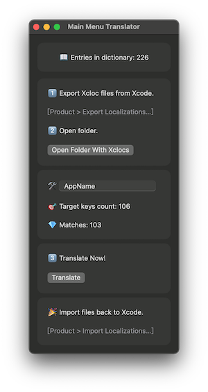

# Main Menu Translator

This app can translate the MainMenu.xib automatically. 

## Description

There was an official tool called AppleGlot to do this, but it stops working after Catalina. Then Apple just deleted AppleGlot without any replacement. Also, other open-source tools all have some problems. Such as the old dictionary, not supporting "zh-Hans/Hant" language code, etc… So I made this app.

It will load its dictionary from several system libraries and apps, keep the strings up to date. It also supports inserting app names into strings.

All you need to do is export xcloc files and translate with this app.

Translate strings are from:

- SwiftUI.framework
- AppKit.framework
- UIKitServices.framework
- UIKitMacHelper.framework
- CoreText.framework
- Script Editor.app
- Terminal.app

## ScreenShot

## Using Open Source Project

[AEXML](https://github.com/tadija/AEXML) (MIT)

